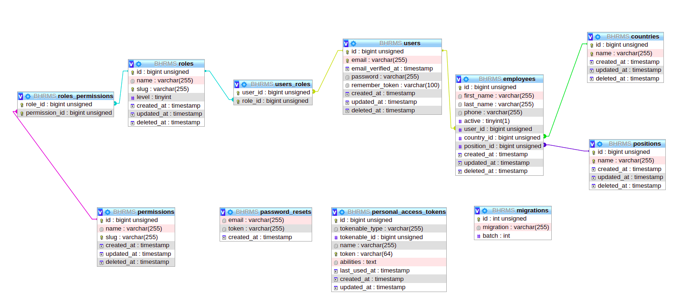

## About BHRMS

BHRMS: is a back-end RESTFull API project , that interact with UI and UX to deliver HR Management system.
 
## Technology stack:
    * PHP 8.1
    * Laravel 9 framework
    * MySql 8

## Setup
* Run Composer install
  * `composer install`
* Copy environment file
  * `cp .env.example .env`
* Generate key
  * `php artisan key:generate`
* Add Database credentials in env file
* Run permissions sync
  * `php artisan permissions:sync`
* Run superadmin create (to create super admin account that have all permissions)
  * `php artisan superadmin:create`

## Task Description:

**First:** The Employee API will be used by users (Employees) to perform the following tasks:
    
    ● Update contact information.
    
    Every User (Employee) will have their own contact details and job title, and status field to
    indicate if their account is active or not.

**Second:** HR Manager APIs will be used to perform the following tasks:

    ● List employees.
    ● Add employees.
    ● Deactivate an employee.

## Actual Result: 
* You can have multiple roles and permissions not only describe above.
* You can activate employee after deactivate it.

## ER Diagram

* Every employee should be a user.
* Every employee may have different permissions depends on the role and permission they have.
* HR manager can set up all countries and positions to be selected by employee.

* With the above schema we can set up different roles and permissions.

Example:if we want to create an HR Manager role, so we need to create a role and then specify the permissions like can list employee and can create employee, etc..

## APIs Structure:

You can find `POSTMAN` collection attached in this repo `BHRMS.postman_collection.json` 

### Auth: 

* Login: `/login` `POST`
  * to login to portal with access conditional, this api will return an `Bearer Token` to use it with below APIs.

### Employees:
* Index : `/employees` `GET`
  * To list all employees.

* Show: `/employees/{id}` `GET`
  * To get employee details.
  
* Create: `/employees` `POST`
  * To create an employee.

* Update: `/employess/{id}` `PUT`
  * To update employee details.

* Activate: `/employees/{employee}/actions/activate` `PATCH`
  * To activate employee profile.

* Deactivate: `/employees/{employee}/actions/deactivate` `PATCH`
  * To deactivate employee profile.

### Roles

* Index : `/roles` `GET`
    * To list all roles.

* Show: `/roles/{id}` `GET`
    * To get role details.

* Create: `/roles` `POST`
    * To create a role.

* Update: `/roles/{id}` `PUT`
    * To update role details.

### Permissions

* Index : `/permissions` `GET`
    * To list all permissions.

* Show: `/permissions/{id}` `GET`
    * To get permission details.

* Create: `/permissions` `POST`
    * To create a permission.

* Update: `/permissions/{id}` `PUT`
    * To update permission details.

### Countries

* Index : `/countries` `GET`
    * To list all countries.

* Show: `/countries/{id}` `GET`
    * To get country details.

* Create: `/countries` `POST`
    * To create a country.

* Update: `/countries/{id}` `PUT`
    * To update country details.

### Positions

* Index : `/positions` `GET`
    * To list all positions.

* Show: `/positions/{id}` `GET`
    * To get position details.

* Create: `/positions` `POST`
    * To create a position.

* Update: `/positions/{id}` `PUT`
    * To update position details.

## Commands:

* `superadmin:create`
    * create super admin that have all permissions.

* `php artisan permissions:sync`
  * to sync all permissions on the platform.

* `permissions:create {name} {slug}`
    * create permission.

* `php artisan role:assign {role} {employee}`
  * to assign role for specific employee.

* `php artisan role:attach {slug} {permission_slug}`
    * attach permission to role.

* `php artisan role:create {name} {slug}`
    * create role.

## Unit Testing:

Upcoming
